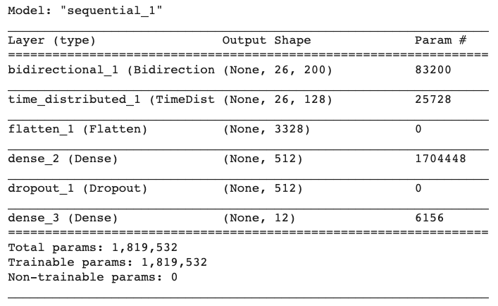
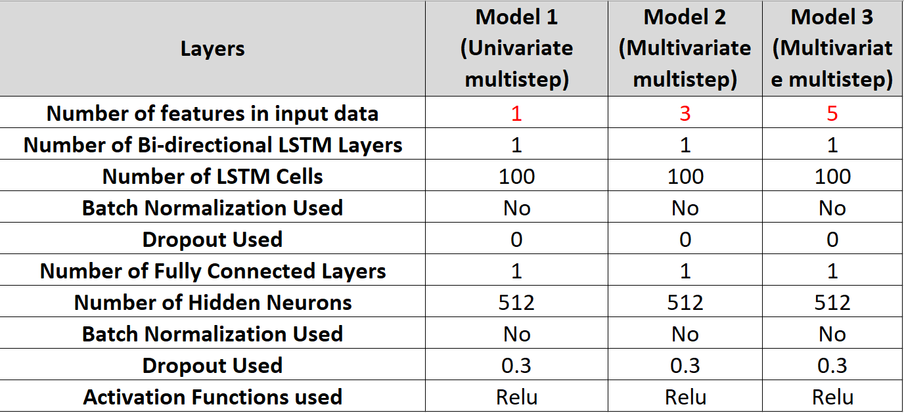
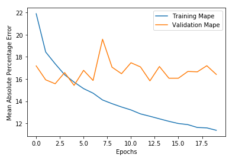
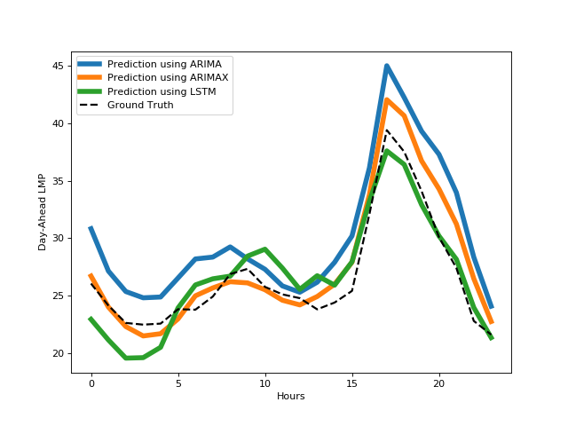

Day-Ahead-Price-Forecasting-using-LSTM
=======================================
State of the art libraries for deep learning such as tensorflow, keras are used to implement a type of RNN called LSTM.

## Content
- [Introduction](README.md#Introduction)
- [Model Architecture](README.md#Model-Architecture)
- [LSTM Model Parameters](README.md#Results)
- [Results](README.md#Results)

## Introduction
Accurately predicting day-ahead prices in the energy
service markets can significantly improve bidding strategies
for participating energy resources in the day-ahead energy
markets to generate higher revenues and optimize their
short-term operational planning. The day-ahead energy
service prices are highly dependent on energy demands or
load forecasting, renewable generation resources, which in turn are highly affected by weather
forecasting and other meteorological features. Hence, the
model needs to complex enough to capture the relationship
between different features and their higher-order terms to
generate even reasonable predictions. Using raw values of historical energy prices for uni-variate
and hourly load consumption for multi-variate model, we
create a new training set within the prediction sequence. As
a result, we predict day-ahead hourly energy prices using all
the lagged energy prices/load consumption values from input
sequence. 

## Model Architecture

## LSTM Model Training

In the model training, we observed the following: 

1. Number of epochs for training is not important. 
2. Batch size greatly influenced the predictions. Lower the batch size, better is the MAPE. 
3. Changing the structure of the network did not signnificant influence in the results 

## Results

